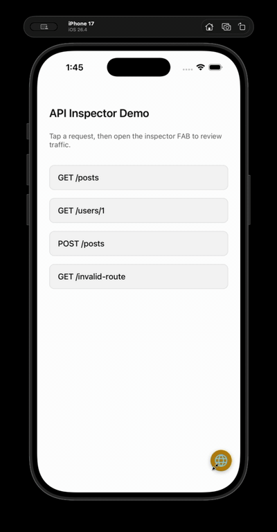
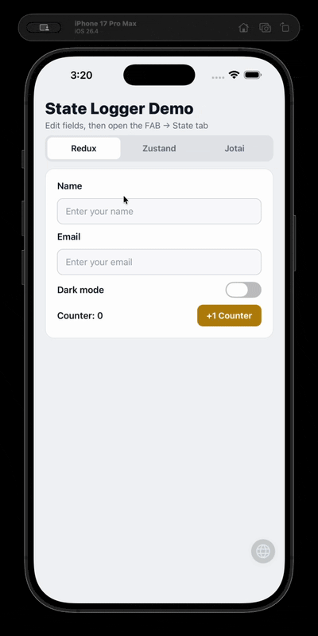

# In-App Devtools

A flexible, in-app devtools library for React Native. Inspect **Network** traffic (Axios / RTK Query) with redaction-by-default, and **State** changes (Redux / Zustand / Jotai) with grouped drill-down — all behind a draggable FAB.

## Demo

### Network



Short walkthrough: FAB, request list, search, detail tabs, redaction, copy cURL.

### State



Short walkthrough: Redux / Zustand / Jotai state groups and drill-down.

## Installation

```bash
npm install react-native-in-app-devtools
```

OR

```bash
yarn add react-native-in-app-devtools
```

### Dependencies

Make sure you have these peer dependencies installed:

```bash
# npm — bare RN / Expo development client
npm install axios @react-native-clipboard/clipboard react-native-svg

# or yarn
yarn add axios @react-native-clipboard/clipboard react-native-svg

# Expo Go (no custom native binary): use expo-clipboard instead
npx expo install expo-clipboard react-native-svg
```

`react-native-svg` is required for the inspector UI. Clipboard packages are **optional**:
if neither is installed, the app still runs — **Copy** buttons simply do nothing
(and log a one-time warning in `__DEV__`). Install one when you want copy to work:

- Bare RN / Expo development client: `@react-native-clipboard/clipboard`
- Expo Go: `expo-clipboard` via `npx expo install expo-clipboard`

**Do not install `@react-native-clipboard/clipboard` in Expo Go** — it is not in the Expo Go binary.

Optional peers (install only what you use):

- `axios` — Axios adapter
- `@reduxjs/toolkit` / `redux` — Redux state logger + RTK Query
- `zustand` — Zustand state logger
- `jotai` — Jotai state logger

## Quick Start

### 1. Initialize (once, before render)

```typescript
// App.tsx or index.ts
import { ApiInspector } from 'react-native-in-app-devtools';

ApiInspector.init({
  enabled: __DEV__,
  maxEntries: 50,
  stateLogger: { maxEntries: 50 }
});
```

**Copy feedback is optional.** The inspector copies to the clipboard but does not show a toast by default. Wire `onCopied` if you want user-visible confirmation:

```typescript
import Toast from 'react-native-toast-message';
import { ApiInspector } from 'react-native-in-app-devtools';

ApiInspector.init({
  enabled: __DEV__,
  maxEntries: 50,
  stateLogger: { maxEntries: 50 },
  onCopied: label =>
    Toast.show({
      type: label === 'Nothing to copy' ? 'info' : 'success',
      text1:
        label === 'Nothing to copy' ? 'Nothing to copy' : `Copied ${label}`,
      visibilityTime: 1500
    })
});
```

`react-native-toast-message` is not a library peer dependency — use any snackbar or toast you prefer, or omit `onCopied` entirely.

### 2. Render the panel

```tsx
import { ApiInspectorPanel } from 'react-native-in-app-devtools';

// App root (behind __DEV__)
<ApiInspectorPanel />;
```

The panel has **Network** and **State** tabs. Zero props by default. Wire HTTP and/or state adapters below to populate them.

### Panel props (optional visuals)

```tsx
<ApiInspectorPanel
  fabColor="#B8860B"
  fabIcon={<YourSvgIcon width={22} height={22} />}
/>
```

| Prop       | Type        | Description                                                        |
| ---------- | ----------- | ------------------------------------------------------------------ |
| `fabColor` | `string`    | Overrides `init({ fabColor })`. Applies to default globe FAB only. |
| `fabIcon`  | `ReactNode` | Custom FAB content. Replaces default `View` + globe when set.      |

### Copy feedback (optional)

The library copies via `@react-native-clipboard/clipboard` when present, otherwise `expo-clipboard`. Expo Go: `npx expo install expo-clipboard`. Bare RN / Expo development client: install `@react-native-clipboard/clipboard` and rebuild the native app. To show feedback after copy (cURL, request body, headers, etc.), pass `onCopied` in `init()` — see Step 1 above.

- `onCopied` receives labels such as `'cURL'`, `'Request'`, `'Response'`, `'Headers'`, or `'Nothing to copy'`
- Render `<Toast />` (or your toast root) at the app root **above** any fullscreen overlays so it stays visible

### 3. Connect your HTTP client (one-time)

Adapter wiring is **one-time**, typically in your HTTP client factory — not at every API call site. Call `ApiInspector.init({ enabled: true })` before traffic runs (logging checks enabled at **request** time).

#### Using Axios?

**Shared factory (recommended)** — attach once; every instance created there is logged automatically:

```typescript
// createHttpClient.ts — one place for your whole app
import axios from 'axios';
import { attachApiInspectorInterceptor } from 'react-native-in-app-devtools/axios';
import { ApiInspector } from 'react-native-in-app-devtools';

export function createHttpClient({ baseURL, ...options }) {
  const instance = axios.create({ baseURL, ...options });

  if (ApiInspector.isEnabled()) {
    attachApiInspectorInterceptor(instance, baseURL);
  }

  return instance;
}
```

If all your API modules use this factory, you don't need anything else for Axios.

**Ad-hoc instances (manual)** — only if you create Axios instances outside your shared factory:

```typescript
import axios from 'axios';
import { ApiInspector } from 'react-native-in-app-devtools';

export const client = ApiInspector.withAxios(axios.create({ baseURL: '/api' }));
```

#### Using RTK Query?

Wrap your **inner** `fetchBaseQuery` with `ApiInspector.withBaseQuery()`. Keep your outer `baseQuery` (401 handling, session refresh, etc.) unchanged.

```typescript
import { createApi, fetchBaseQuery } from '@reduxjs/toolkit/query/react';
import { ApiInspector } from 'react-native-in-app-devtools';

// Inner query — wrapped for logging
const instrumentedFetch = ApiInspector.withBaseQuery(
  fetchBaseQuery({ baseUrl: '/api' }),
  { baseUrl: '/api' } // optional: helps resolve relative URLs in the inspector
);

export const api = createApi({
  reducerPath: 'api',
  // Outer wrapper — your auth/session logic stays here
  baseQuery: async (args, api, extraOptions) => {
    const result = await instrumentedFetch(args, api, extraOptions);
    // handle 401, refresh token, etc.
    return result;
  },
  endpoints: () => ({})
});
```

### 4. Connect state logging (one-time)

Wire adapters when you create the store — same idea as HTTP. The **State** tab groups by parent label (e.g. `profile/setName` → group `profile`). Noisy RTK Query cache actions are ignored by default in the Redux logger.

#### Redux

```typescript
import { configureStore } from '@reduxjs/toolkit';
import { createReduxStateLoggerMiddleware } from 'react-native-in-app-devtools';
// or: 'react-native-in-app-devtools/redux'

export const store = configureStore({
  reducer: {
    /* ... */
  },
  middleware: getDefaultMiddleware =>
    getDefaultMiddleware().concat(createReduxStateLoggerMiddleware())
});
```

#### Zustand

```typescript
import { create } from 'zustand';
import { withZustandLogger } from 'react-native-in-app-devtools/zustand';

export const useProfileStore = create(
  withZustandLogger(
    set => ({
      name: '',
      setName: (name: string) => set({ name })
    }),
    { name: 'profile' }
  )
);
```

#### Jotai

Atoms are anonymous by default — set `debugLabel` (required by default) so rows are readable:

```typescript
import { atom, createStore } from 'jotai';
import { attachJotaiLogger } from 'react-native-in-app-devtools/jotai';

export const nameAtom = atom('');
nameAtom.debugLabel = 'profile/name';

export const jotaiStore = createStore();
attachJotaiLogger(jotaiStore, {
  requireDebugLabel: true
  // storeName: 'demo' // optional; default prefix is "jotai" → jotai:profile/name
});
```

## API Reference

### `ApiInspector.init(config)`

| Option        | Type                      | Default   | Description                                                                                                             |
| ------------- | ------------------------- | --------- | ----------------------------------------------------------------------------------------------------------------------- |
| `enabled`     | `boolean`                 | `false`   | When false, interceptors, state loggers, and UI are no-ops                                                              |
| `maxEntries`  | `number`                  | `50`      | Max in-memory **network** log entries                                                                                   |
| `stateLogger` | `StateLoggerConfig`       | —         | State logger options: `{ maxEntries?, ignoreAction?, ignoreAtom? }`                                                     |
| `onCopied`    | `(label: string) => void` | —         | Optional callback after copy actions. Not a built-in toast — wire your own UI (e.g. `Toast.show`) if you want feedback. |
| `fabColor`    | `string`                  | `#B8860B` | FAB background color override                                                                                           |

### `ApiInspector` methods

| Method                                      | Description                                    |
| ------------------------------------------- | ---------------------------------------------- |
| `isEnabled()`                               | Whether the inspector is active                |
| `withAxios(instance, baseURL?)`             | Attach interceptor to an Axios instance        |
| `withBaseQuery(baseQuery, options?)`        | Wrap RTK `fetchBaseQuery` (or compatible) for network logging |
| `notifyCopied(label)`                       | Trigger the `onCopied` callback                |

## Exports

```typescript
import {
  // Core API
  ApiInspector,
  isApiInspectorEnabled,

  // UI
  ApiInspectorPanel,
  ApiInspectorPanelProps,

  // Hooks
  useApiLogEntries,
  useStateLogEntries,

  // Redux state logger (also on /redux)
  createReduxStateLoggerMiddleware,

  // Utilities
  buildCurlFromLogEntry,
  attachApiInspectorInterceptor,

  // Types
  ApiInspectorConfig,
  ApiLogEntry,
  ApiLogStatus,
  StateLogEntry,
  StateLoggerConfig
} from 'react-native-in-app-devtools';

// Subpaths
import { attachApiInspectorInterceptor } from 'react-native-in-app-devtools/axios';
import { withBaseQuery } from 'react-native-in-app-devtools/rtk';
import { createReduxStateLoggerMiddleware } from 'react-native-in-app-devtools/redux';
import { withZustandLogger } from 'react-native-in-app-devtools/zustand';
import { attachJotaiLogger } from 'react-native-in-app-devtools/jotai';
```

## License

MIT
